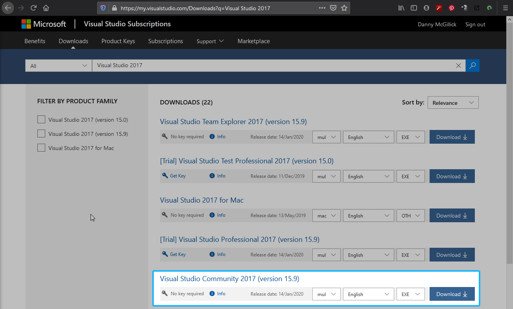
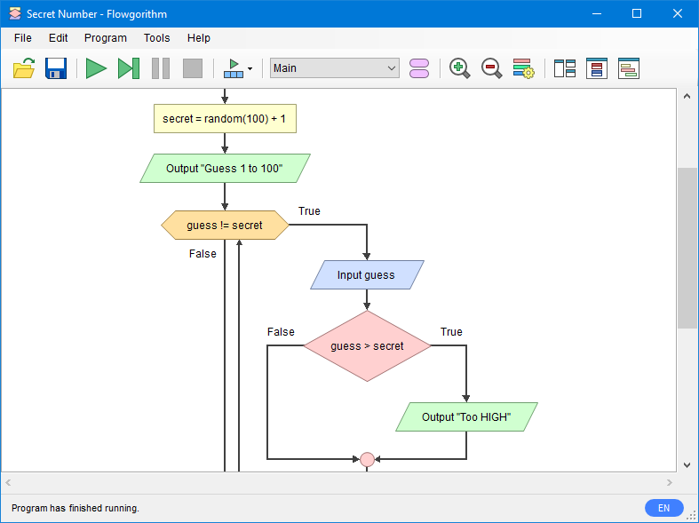

## Intro

Hey welcome to introduction to Software Engineering. Everyone. So much software.

## Class Notes

Each class will have notes. You can access them from the menu to the left (desktop) or above (small windows, mobile.) Here's a linke to [week 1](ise102_week1.html). Pic of Bjarne below.

## Required software

You'll need to use the software below to complete classwork and assessments, so install it before our first class.



### Visual Studio Community 2017

Microsoft Visual Studio is the industry standard C++ development environment used to make game engines. 

Head to this [Visual Studio 2017 Downloads page](https://my.visualstudio.com/Downloads?q=Visual%20Studio%202017) and grab the version I've hilighted in the image above.



 

### Flowgorithm 

Flowgorithm lets you program visually via [flowcharting (wikipedia)](https://en.wikipedia.org/wiki/
Flowchart), then generates code in pseudocode, C++ or other languages.

Choose the appropriate download for your situation:

| Link | Who should download it |
|------|---------|
| [Flowgorithm Downloads](http://flowgorithm.org/download/index.htm) | You're working on your own machine. Grab the full 64 bit installer. |
| [Flowgorithm portable](https://dmcgits.github.io/mds/ISE102/assets/index/flowgorithm_micro.zip) | You are on a uni lab machine (no install rights). The portable version can be run without installing. |
